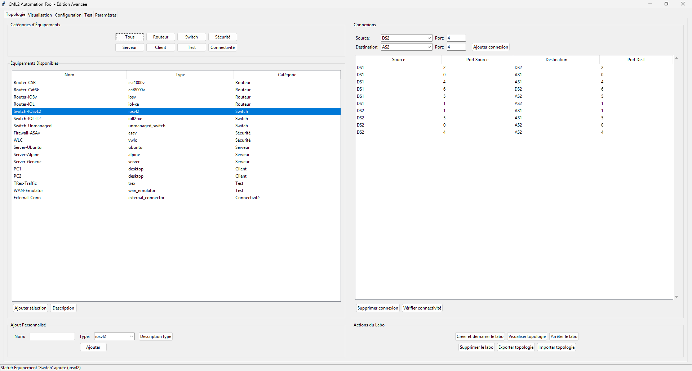

# 🚀 CML2 Automation Tool - Édition Avancée


**Une interface graphique complète pour automatiser Cisco Modeling Lab 2**  
*Créez, configurez et testez des topologies réseau complexes en quelques clics*

[🚀 Fonctionnalités](#-fonctionnalités) • [📦 Installation](#-installation) • [🎮 Utilisation](#-utilisation) • [⚙️ Configuration](#️-configuration) • [🛠️ Développement](#️-développement)

---

## 📋 Table des Matières

- [🌟 Vue d'ensemble](#-vue-densemble)
- [✨ Fonctionnalités](#-fonctionnalités)
- [🎬 Démonstration Vidéo](#-démonstration-vidéo)
- [📸 Captures d'écran](#-captures-décran)
- [⚡ Installation Rapide](#-installation-rapide)
- [🔧 Installation Détailée](#-installation-détaillée)
- [🎮 Guide d'Utilisation](#-guide-dutilisation)
- [⚙️ Configuration CML2](#️-configuration-cml2)
- [🔍 Tests et Validation](#-tests-et-validation)
- [🏗️ Architecture](#️-architecture)
- [🧩 Extensibilité](#-extensibilité)
- [🐛 Dépannage](#-dépannage)
- [📁 Structure](#-structure)
- [🤝 Contribution](#-contribution)
- [📜 Licence](#-licence)
- [📞 Support](#-support)
- [🔮 Roadmap](#-roadmap)

---

## 🌟 Vue d'ensemble

**CML2 Automation Tool** est une application desktop Python qui transforme la gestion de labs réseau Cisco CML2 en une expérience visuelle intuitive.

### 🎯 Public cible
- **Ingénieurs réseau** souhaitant automatiser leurs labs
- **Éducateurs** créant des environnements de formation
- **Étudiants** en réseaux et cybersécurité
- **Architectes** validant des designs réseau

### 🔑 Avantages clés
- **⏱️ Gain de temps** : Réduction de 80% du temps de déploiement
- **👨‍💻 Interface intuitive** : Pas besoin de lignes de commande
- **🔄 Reproductibilité** : Sauvegarde et réutilisation des topologies
- **🔗 Intégration complète** : Interface native avec l'API CML2

---

## ✨ Fonctionnalités

### 🏗️ Gestion de Topologie
- **Éditeur graphique** drag-and-drop
- **16 types d'équipements** (routeurs, switches, pare-feux, serveurs)
- **Gestion des connexions** avec ports spécifiques
- **Import/Export JSON** des topologies
- **Validation automatique** de la connectivité

### 🎨 Visualisation Avancée
- **Trois layouts** : Circulaire, Grille, Hiérarchique
- **Zoom et déplacement** fluides
- **Couleurs par catégorie** d'équipement
- **Surbrillance** des connexions

### ⚙️ Configuration Automatisée
- **Templates préconfigurés** pour tous les équipements
- **Éditeur avec coloration syntaxique**
- **Validation en temps réel** des configurations
- **Application en un clic** sur les équipements

### 🔬 Tests et Monitoring
- ✅ Tests de connectivité (ping, traceroute)
- ✅ Commandes show prédéfinies
- ✅ Commandes personnalisées
- ✅ Journalisation complète
- ✅ Export des résultats

### 🔄 Intégration CML2
- Connexion sécurisée via API
- Gestion complète du cycle de vie des labs
- Synchronisation en temps réel
- Support des images CML2 officielles

---

## 🎬 Démonstration Vidéo

### Vidéo de présentation
[](https://www.youtube.com/watch?v=VIDEO_ID)

*Cliquez sur l'image pour regarder la démonstration complète (10 minutes)*

### Tutoriels rapides
1. **[Installation et configuration](https://www.youtube.com/watch?v=VIDEO_ID_1)** - 5 min
2. **[Création d'une topologie](https://www.youtube.com/watch?v=VIDEO_ID_2)** - 8 min
3. **[Configuration avancée](https://www.youtube.com/watch.youtube.com/watch?v=VIDEO_ID_3)** - 12 min
4. **[Tests et validation](https://www.youtube.com/watch?v=VIDEO_ID_4)** - 7 min

### Playlist complète
📺 **[Playlist YouTube complète](https://www.youtube.com/playlist?list=VOTRE_LIST_ID)** - Toutes les vidéos tutoriels

---

## 📸 Captures d'écran

### Interface de Configuaration et Topologies 
| Vue d'ensemble | Éditeur de topologie |
|----------------|----------------------|
|  |  |

### Visualisation
| Layout circulaire | Layout hiérarchique |
|-------------------|---------------------|
|  |  |

### Configuration et tests
| Éditeur de configuration | Résultats de tests |
|--------------------------|-------------------|
|  |  |

### Galerie complète
📷 **[Voir toutes les captures d'écran](screenshots/)** - Dossier complet des screenshots

---

## ⚡ Installation Rapide

### Prérequis
- **Python 3.8+**
- **Contrôleur CML2 accessible**
- **2 Go de RAM minimum**

### Installation en 3 étapes
```bash
# 1. Cloner le repository
git clone https://github.com/votre-username/cml2-automation-tool.git
cd cml2-automation-tool

# 2. Installer les dépendances
pip install -r requirements.txt

# 3. Lancer l'application
Automatisation_avec_interface_graphique.py
